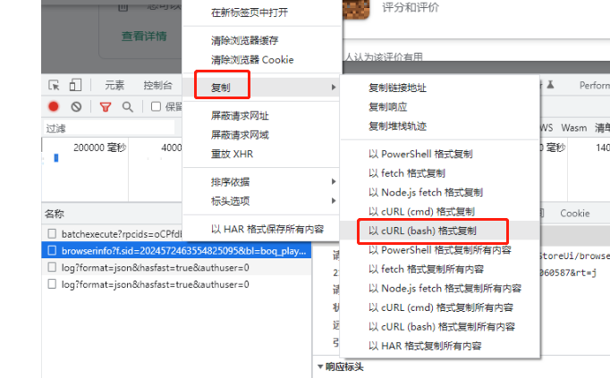

使用方法：

    usage: curl2python.exe [-h] [-o OUTPUT] [-n NAME] input

    positional arguments:
    
      input                 指定保存curl命令的文件路径。例子：D:\curl.txt
    
    optional arguments:
    
      -h, --help            show this help message and exit
    
      -o OUTPUT, --output OUTPUT
                            文件输出目录，不传则与源文件同目录
    
      -n NAME, --name NAME  输出的python文件名

获取curl方法：
1. 打开谷歌浏览器，按F12

2. 在网络中右键链接请求，复制，以cURL(base)格式复制

3. 将复制的内容写入txt文档中，下面为复制结果示例
```shell
curl 'https://play.google.com/_/PlayStoreUi/browserinfo?f.sid=2024572463554825095&bl=boq_playuiserver_20230201.07_p0&hl=zh-CN&authuser=0&soc-app=121&soc-platform=1&soc-device=1&_reqid=1060587&rt=j' \
  -H 'authority: play.google.com' \
  -H 'accept: */*' \
  -H 'accept-language: zh-CN,zh;q=0.9' \
  -H 'content-type: application/x-www-form-urlencoded;charset=UTF-8' \
  -H 'cookie: OGPC=19033114-1:; OGP=-19033114:; _ga=GA1.3.1679718639.1674091637; OTZ=6863127_24_24__24_; SID=TQjTXKAHmb4gWSrAbLSsdz_58eBtNpiNcRVOOCakH4WpYLcNB8E5VFLSYRGK1_9ObtXmKQ.; __Secure-1PSID=TQjTXKAHmb4gWSrAbLSsdz_58eBtNpiNcRVOOCakH4WpYLcNEQ0rJOLVCMg1dXAGtneNhg.; __Secure-3PSID=TQjTXKAHmb4gWSrAbLSsdz_58eBtNpiNcRVOOCakH4WpYLcNSFSSe5psY9TVfe97jsMEWg.; HSID=A93s_71IB4LApvbiP; SSID=APejNQ0WdaVL4dWEv; APISID=rZcwtJQQGnhW8gnm/AQ3um4cuu-inlonyR; SAPISID=fY2WxYP5PqmuNME1/AtuBc_pIj2yrHkzNS; __Secure-1PAPISID=fY2WxYP5PqmuNME1/AtuBc_pIj2yrHkzNS; __Secure-3PAPISID=fY2WxYP5PqmuNME1/AtuBc_pIj2yrHkzNS; SEARCH_SAMESITE=CgQIupcB; AEC=ARSKqsIwK5WguJdXhACQlKZu8jOK31MpFCa917_qTIjmiYhEwGZ5ObmnpQs; 1P_JAR=2023-02-07-00; PLAY_ACTIVE_ACCOUNT=ICrt_XL61NBE_S0rhk8RpG0k65e0XwQVdDlvB6kxiQ8=authuser-0; OSID=TwjTXPCt7CzeNC0-QCVZyjfkvg6AprEDtU56qpoMz8XOxvSAH1KwtUx9f-Ct8s5mzCpXHQ.; __Secure-OSID=TwjTXPCt7CzeNC0-QCVZyjfkvg6AprEDtU56qpoMz8XOxvSAul5AOoIz5Tef_cN1wP5OFA.; _gid=GA1.3.1575353759.1675759784; NID=511=YdU8HDWzvtCOKj4WmO2qjyCPKzAwhHFUhuxBbS93t-00-6HUO1ALQcsfLPMPTR1haL1x4veyulQv7CU_SQBeONMpr0Q_0SfvChsclylHPtMAKdLDwt0SezFLv4tLXmAJLn3SSBalNpJKARaN_ZY9y2wL9hzrpobS2PrzU73h3IbSNjziAlnFQdkTvpLoDdq3TpJfYhx9hM0ngFltqAWDsRZTlGohPxVnBs49wR0Ev0IrHf2ClILuy9MEUBMl6XC6aTs; SIDCC=AFvIBn_T_BxTlf36h7ERXv2QHkvM2iqxIFyf6p6taYj6RGu45wXTfCSFAex2J_00orTprgiHDA; __Secure-1PSIDCC=AFvIBn8EGS36hzw5RmmLTgJr0Z8M8SwD6eO6ydv4jrOMTsk1vBlcwLQJbaYVENFwxInMr_LyMA; __Secure-3PSIDCC=AFvIBn_-OwsTR9fN2bASL7pNusN3Pw4pqr-Am3WdUHi1JP6Z-XcAP8P0poSW9EeiFJDpFCyjSg' \
  -H 'origin: https://play.google.com' \
  -H 'referer: https://play.google.com/' \
  -H 'sec-ch-ua: "Not_A Brand";v="99", "Google Chrome";v="109", "Chromium";v="109"' \
  -H 'sec-ch-ua-arch: "x86"' \
  -H 'sec-ch-ua-bitness: "64"' \
  -H 'sec-ch-ua-full-version: "109.0.5414.120"' \
  -H 'sec-ch-ua-full-version-list: "Not_A Brand";v="99.0.0.0", "Google Chrome";v="109.0.5414.120", "Chromium";v="109.0.5414.120"' \
  -H 'sec-ch-ua-mobile: ?0' \
  -H 'sec-ch-ua-model;' \
  -H 'sec-ch-ua-platform: "Windows"' \
  -H 'sec-ch-ua-platform-version: "10.0.0"' \
  -H 'sec-ch-ua-wow64: ?0' \
  -H 'sec-fetch-dest: empty' \
  -H 'sec-fetch-mode: cors' \
  -H 'sec-fetch-site: same-origin' \
  -H 'user-agent: Mozilla/5.0 (Windows NT 10.0; Win64; x64) AppleWebKit/537.36 (KHTML, like Gecko) Chrome/109.0.0.0 Safari/537.36' \
  -H 'x-client-data: CJW2yQEIorbJAQjEtskBCImSygEIqZ3KAQiv3soBCJKhywEI64LNAQixhM0BCM6EzQEI64vNAQiPjM0BCNiMzQEIyI3NAQjUjs0BCNLhrAII8PStAg==' \
  -H 'x-same-domain: 1' \
  --data-raw 'f.req=%5B9%2C1%2C1%2C%5Bnull%2C768%2C1366%5D%2C%5Bnull%2C150%2C1366%5D%2C%5Btrue%2Ctrue%2Cnull%2Ctrue%5D%2C%5Bfalse%2C2%2C2%5D%5D&at=AP-w-ruBNb5Qt_-y9wW5rkRwKmPk%3A1675759780985&' \
  --compressed`
"# curl2python" 
